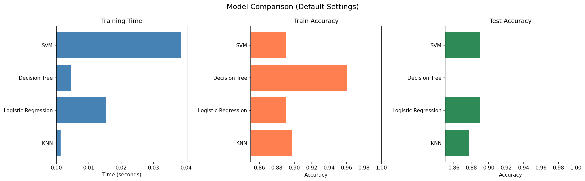
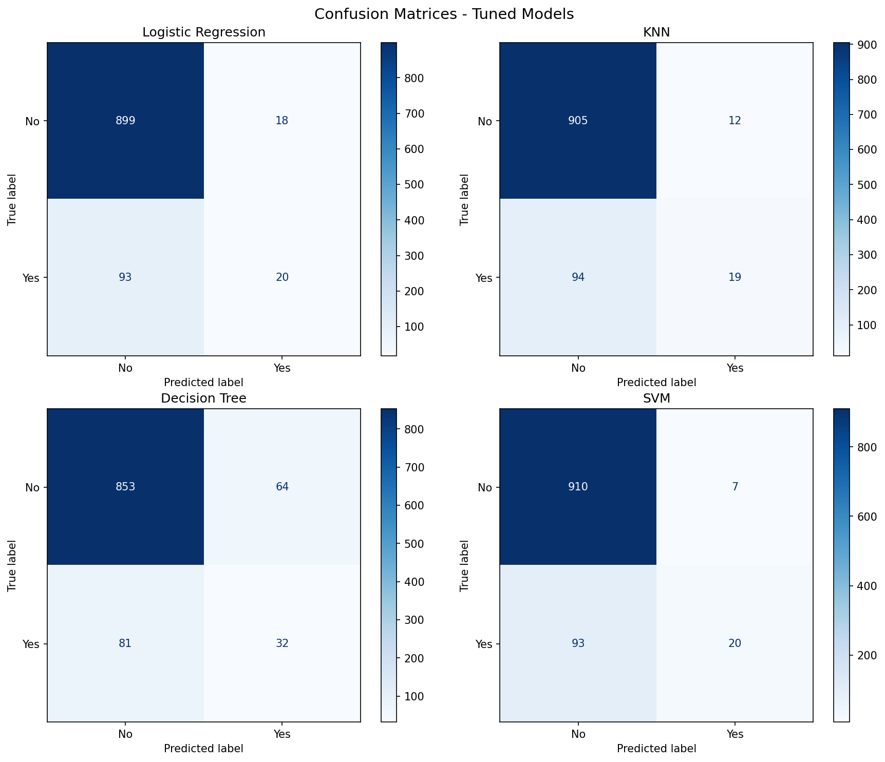
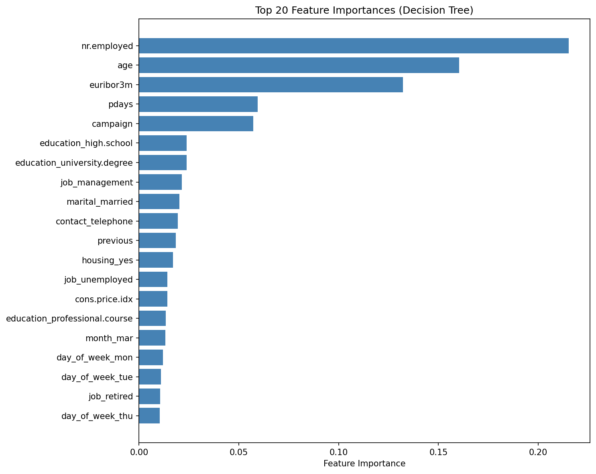

# Bank Marketing Classifier Comparison — Analysis Report

## 1. Business Problem

A Portuguese banking institution conducted phone-based marketing campaigns (May 2008 – November 2010) to sell long-term term deposits. The goal is to **predict whether a client will subscribe to a term deposit** based on client demographics, campaign data, and economic indicators. Accurate predictions enable the bank to:

- **Optimize targeting** — prioritize high-probability clients
- **Reduce costs** — fewer calls per successful conversion
- **Increase success rate** — improve campaign ROI

## 2. Data Overview

- **Dataset**: UCI Bank Marketing Dataset (Moro et al., 2014)
- **File**: `bank-additional.csv` — 10% random sample (~4,119 rows)
- **Full dataset**: `bank-additional-full.csv` contains all 41,188 contacts
- **Features**: 20 input variables (demographic, campaign, economic)
- **Target**: `y` — subscribed to term deposit (yes/no)
- **Class Imbalance**: ~88.7% "no" vs ~11.3% "yes"
- **Missing Values**: No actual NaN values; "unknown" used as a category in job, marital, education, default, housing, and loan
  - `default` has the highest unknown rate (~20.9%)

### Feature Categories

| Category | Features |
|----------|----------|
| Bank Client | age, job, marital, education, default, housing, loan |
| Campaign | contact, month, day_of_week, campaign, pdays, previous, poutcome |
| Economic | emp.var.rate, cons.price.idx, cons.conf.idx, euribor3m, nr.employed |
| Excluded | duration (data leakage — only known post-call) |

## 3. Methodology

Here's the approach I followed for this analysis:

1. **Understood the problem** — predict term deposit subscription
2. **Explored the data** — looked at features, distributions, and unknown values
3. **Prepared the data** — one-hot encoding, target encoding, train/test split (75/25, stratified)
4. **Built models** — compared 4 classifiers in two phases:
   - **Phase 1**: Bank client features only, default hyperparameters
   - **Phase 2**: All features (excl. duration), StandardScaler for KNN/SVM, GridSearchCV with F1 scoring
5. **Evaluated results** — accuracy, F1 score, confusion matrices, ROC curves

### Classifiers Used

- K-Nearest Neighbors (KNN)
- Logistic Regression
- Decision Tree
- Support Vector Machine (SVM)

## 4. Key Statistics

### Target Distribution (bank-additional.csv, ~4,119 rows)
- No (did not subscribe): ~3,668 (~88.7%)
- Yes (subscribed): ~451 (~11.3%)

### Baseline Performance
- A naive model predicting "no" for all clients achieves **89.03% accuracy**
- This highlights why accuracy alone is a misleading metric for imbalanced data

## 5. Findings

### Phase 1: Default Models (Bank Client Features Only)

Using only the 7 bank client features (age, job, marital, education, default, housing, loan) with default hyperparameters:

| Model | Train Time (s) | Train Accuracy | Test Accuracy | vs Baseline |
|-------|---------------|----------------|---------------|-------------|
| KNN | 0.0006 | 89.71% | 87.77% | -1.26% |
| Logistic Regression | 0.0151 | 89.06% | 89.03% | +0.00% |
| Decision Tree | 0.0040 | 96.02% | 81.84% | -7.19% |
| SVM | 0.0377 | 89.06% | 89.03% | +0.00% |

With only demographic features, none of the classifiers really beat the baseline. Logistic Regression and SVM both landed at exactly the baseline accuracy (89.03%), which means they basically just learned to predict "no" every time. This suggests that features like age, job, marital status, and education don't carry much useful signal for this prediction. KNN came in slightly below baseline (87.77%), possibly because distance-based methods don't work well when most features are one-hot encoded categories. The Decision Tree had the biggest gap between train and test accuracy (96.02% vs 81.84%) — it clearly overfitted to the training data. Overall, Phase 1 showed that bank client features alone aren't enough to make useful predictions.

### Phase 2: Full Features (All Features, Default Params)

Adding campaign, previous-campaign, and economic features (19 total, excluding duration):

| Model | Train Time (s) | Train Accuracy | Test Accuracy | vs Baseline |
|-------|---------------|----------------|---------------|-------------|
| KNN | 0.0002 | 91.52% | 89.71% | +0.68% |
| Logistic Regression | 0.3591 | 90.58% | 90.29% | +1.26% |
| Decision Tree | 0.0087 | 100.00% | 83.88% | -5.15% |
| SVM (linear) | 0.0908 | 90.06% | 90.29% | +1.26% |

Adding the campaign and economic features made a noticeable difference. Logistic Regression and SVM both improved to 90.29% test accuracy, which is about 1.3% above the baseline — not huge, but it shows these extra features do help. SVM with a linear kernel matched Logistic Regression and trained quickly, so linear approaches seem to work well here. KNN got better (89.71%) but still trailed the linear models, probably because having 50+ one-hot encoded features makes distance calculations less effective. The Decision Tree hit 100% on training data but only 83.88% on test data, so it was still overfitting without any depth limits. Comparing Phase 1 to Phase 2, it's clear that the economic indicators (like employment rate and euribor rate) are much more useful than demographics for predicting who will subscribe.

### Phase 3: Tuned Models (GridSearchCV with F1 Scoring)

Hyperparameter tuning optimized for F1-score (minority class performance) rather than accuracy:

| Model | Best Params | CV F1 | Test Accuracy | Test F1 |
|-------|-------------|-------|---------------|---------|
| Logistic Regression | C=10, solver=lbfgs | 0.3581 | 89.22% | 0.2649 |
| KNN | n_neighbors=5, weights=uniform | 0.3281 | 89.71% | 0.2639 |
| Decision Tree | max_depth=15, min_samples_split=2 | 0.3244 | 85.92% | 0.3062 |
| SVM | C=0.1, kernel=linear | 0.3295 | 90.29% | 0.2857 |

By tuning for F1-score instead of accuracy, the models try harder to identify the "yes" class, which is what actually matters for the business. The F1 scores are still fairly low (0.26 to 0.31), which makes sense since only ~11% of the data is "yes" — it's just a hard class to predict.

The Decision Tree had the best test F1 (0.3062) but lower accuracy (85.92%), meaning it catches more potential subscribers but also has more false alarms. Logistic Regression had the best cross-validated F1 (0.3581), suggesting it performs the most consistently across different data splits. SVM kept the highest accuracy (90.29%) with decent F1 (0.2857) — it's more cautious and doesn't predict "yes" very often. KNN was similar to Logistic Regression without any clear advantage.

The main takeaway here is that accuracy and F1 can point to different "best" models. Which one matters more depends on the business — if missing a subscriber is worse than making an extra call, then the Decision Tree's higher F1 would be more useful.

### Hyperparameter Search Space

| Model | Parameter Grid |
|-------|---------------|
| Logistic Regression | C: [0.01, 0.1, 1, 10], solver: [lbfgs, liblinear] |
| KNN | n_neighbors: [3, 5, 7, 11, 15], weights: [uniform, distance] |
| Decision Tree | max_depth: [3, 5, 7, 10, 15, None], min_samples_split: [2, 5, 10] |
| SVM | C: [0.01, 0.1, 1, 10], kernel: [linear] |

## 6. Visualizations

### Model Comparison (Default Settings)

### Confusion Matrices (Tuned Models)

### ROC Curves

### Feature Importance (Decision Tree)

## 7. Recommendations

1. **Logistic Regression is a good choice** for this problem — it's fast, easy to interpret, and performed well across both accuracy and F1.

2. **Pay attention to economic indicators** — features like euribor3m and employment rate turned out to be much more predictive than client demographics, so the timing of campaigns relative to economic conditions seems to matter a lot.

3. **Don't rely on accuracy alone** — with such imbalanced classes, F1 score gives a better picture of how well the model identifies potential subscribers.

4. **Don't use call duration as a feature** — it's only known after the call ends, so including it would be data leakage.

## 8. Next Steps

- **Try ensemble methods** like Random Forest or Gradient Boosting, which might improve results
- **Handle class imbalance** using oversampling (e.g., SMOTE) or adjusting class weights
- **Think about costs** — a missed subscriber and a wasted call have different costs to the bank, and the model threshold could be adjusted accordingly
- **Try removing less useful features** to see if a simpler model performs just as well
